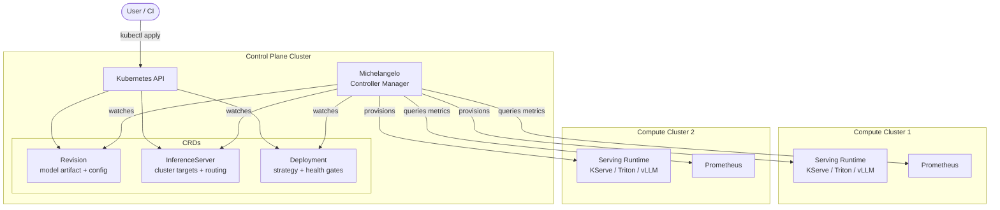
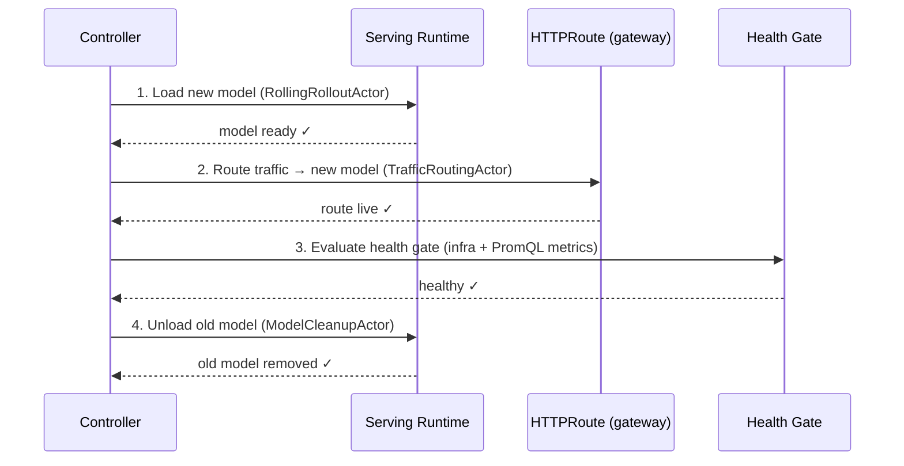
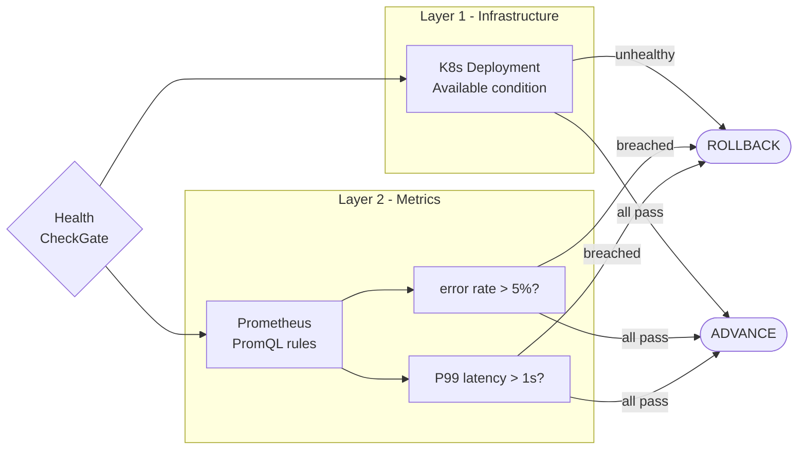
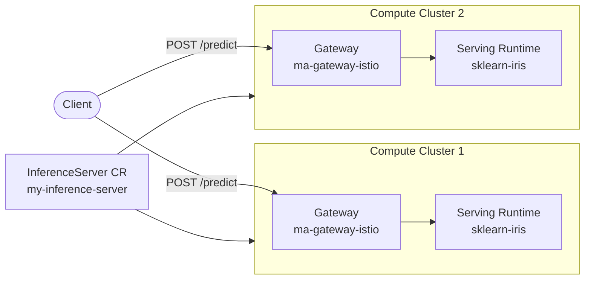

[](https://github.com/michelangelo-ai/michelangelo/releases)
[](http://www.apache.org/licenses/LICENSE-2.0)
[](https://codecov.io/gh/michelangelo-ai/michelangelo)
[](https://www.bestpractices.dev/projects/11481)

# Michelangelo-AI

Michelangelo-AI is an open-source **ML deployment control plane** — built to safely roll out models across multiple clusters, catch regressions via custom metrics, and recover automatically, with any serving runtime underneath.

> :warning: **Beta** — APIs and features may evolve as we stabilize.

---

## The problem

Running a model on one cluster is solved. The hard part is:

- Rolling out a new model version **across 10 clusters** without a single bad deployment taking down production
- **Automatically rolling back** when your error rate spikes — not after an on-call wakes up
- Doing all of this **with any serving runtime** (KServe, Triton, vLLM) without rebuilding your deployment pipeline

Michelangelo is the control plane that sits above your serving runtime and handles this.

---

## How it works

### CRD-based architecture

Everything is declarative Kubernetes CRDs managed by the Michelangelo controller:

```
Revision          →  what to deploy (model artifact + serving config)
InferenceServer   →  where to serve  (cluster targets, routing, gateway)
Deployment        →  how to roll out (strategy, health gates, rollback rules)
```



### Rollout engine

The controller runs an ordered actor chain per deployment. Each actor must complete before the next runs — if the health gate fails, the controller rolls back automatically.

The sequence per cluster is:



All target clusters complete steps 1–2 before any cluster runs step 4. The old model is only removed after every cluster has routed traffic to the new one — the same pattern as Uber's internal multi-zone rollout.

### Health gate

Two layers of health checking evaluated on every reconcile during rollout:



Fail-open: if Prometheus is unreachable, the metric layer returns healthy — no spurious rollbacks.

---

## Model Serving

### InferenceServer

The `InferenceServer` CR declares where a model runs. It manages cluster registration, gateway routing, and TLS — independently of what serves the model:



```yaml
apiVersion: michelangelo.api/v2
kind: InferenceServer
metadata:
  name: my-inference-server
spec:
  clusterTargets:
    - clusterId: compute-1
      kubernetes:
        host: "https://compute-1.internal"
        port: 6443
      tokenTag: compute-1-token
      caDataTag: compute-1-ca
    - clusterId: compute-2
      kubernetes:
        host: "https://compute-2.internal"
        port: 6443
      tokenTag: compute-2-token
      caDataTag: compute-2-ca
```

One CR — two clusters. The controller provisions the serving stack on both.

### Supported runtimes

Michelangelo is runtime-agnostic. The `servingSpec.version` field accepts any container image:

| Runtime | Example image |
|---|---|
| **KServe** (sklearn, PyTorch, ONNX) | via `InferenceService` CR on the target cluster |
| **NVIDIA Triton** | `nvcr.io/nvidia/tritonserver:23.04-py3` |
| **vLLM** | `vllm/vllm-openai:latest` |
| **Custom** | any image with an HTTP inference endpoint |

Swapping runtimes doesn't change how the `Deployment` CR or rollout lifecycle works.

---

## Deployment & Rollout

### Deployment CR

```yaml
apiVersion: michelangelo.api/v2
kind: Deployment
metadata:
  name: my-model-deployment
spec:
  desiredRevision:
    name: my-model-v2
  inferenceServer:
    name: my-inference-server
  strategy:
    rolling:
      incrementPercentage: 10   # advance 10% of traffic at a time
  definition:
    type: TARGET_TYPE_INFERENCE_SERVER
```

The controller shifts traffic incrementally across all `clusterTargets`, advancing only when the health gate passes at each step.

### Metric health gates

Define rollback rules directly in the Deployment spec using PromQL. The controller evaluates these on every reconcile cycle during rollout:

```yaml
spec:
  healthCheckConfig:
    prometheusUrl: "http://prometheus:9090"
    rules:
      - name: high-error-rate
        query: >-
          rate(kserve_inference_service_request_total{
            name="my-model", response_code!~"2.."}[2m])
          / rate(kserve_inference_service_request_total{name="my-model"}[2m])
        op: GT
        threshold: 0.05      # roll back if error rate > 5%

      - name: high-latency-p99
        query: >-
          histogram_quantile(0.99,
            rate(kserve_inference_service_request_latency_seconds_bucket{
              name="my-model"}[2m]))
        op: GT
        threshold: 1.0       # roll back if P99 latency > 1s
```

**Operators:** `GT`, `LT`, `GTE`, `LTE`

**Fail-open:** if Prometheus is unreachable, the gate returns healthy — no spurious rollbacks.

### Triggering and recovering from rollback

Force a rollback (useful for testing or live demos):

```bash
kubectl patch deployment my-model-deployment --type=merge -p '{
  "spec": {"healthCheckConfig": {"rules": [
    {"name":"force-rollback","query":"vector(1)","op":"GT","threshold":0}
  ]}}
}'
```

The controller detects the breach within one reconcile cycle (~30s) and rolls back.

Clear the rules to resume:

```bash
kubectl patch deployment my-model-deployment --type=merge -p '{
  "spec": {"healthCheckConfig": {"rules": []}}
}'
```

---

## Quickstart

### Prerequisites

```bash
brew install k3d kubectl helm
git clone https://github.com/michelangelo-ai/michelangelo.git
cd michelangelo/python && poetry install && source .venv/bin/activate
```

### Single-cluster sandbox

```bash
ma sandbox create
ma sandbox demo inference
```

### Multi-cluster sandbox with KServe

```bash
# Create control plane + compute cluster
ma sandbox create --create-compute-cluster

# Install KServe on compute-1, deploy sklearn-iris, wire health gates
ma sandbox demo kserve
```

`ma sandbox demo kserve` sets up the full stack automatically:
- cert-manager + KServe v0.13.1 in RawDeployment mode (no Knative required)
- Custom Triton `ClusterServingRuntime`
- `sklearn-iris` InferenceService from GCS
- Michelangelo `InferenceServer` + `Deployment` CRs with metric health rules

Test the endpoint:

```bash
kubectl --context k3d-michelangelo-compute-1 \
  port-forward svc/sklearn-iris-predictor -n default 8081:80

curl -X POST http://localhost:8081/v1/models/sklearn-iris:predict \
  -H "Content-Type: application/json" \
  -d '{"instances": [[6.8, 2.8, 4.8, 1.4]]}'
# → {"predictions": [1]}
```

Apply the deployment with health gates:

```bash
kubectl apply -f python/michelangelo/cli/sandbox/demo/kserve/deployment-with-healthcheck.yaml
```

---

## ML Pipelines

Michelangelo also covers the training side of the lifecycle. Define DAGs with `@task` and `@workflow` decorators, backed by Temporal orchestration:

```python
import michelangelo.uniflow.core as uniflow

@uniflow.task()
def train(learning_rate: float = 0.01) -> str:
    return "model_path"

@uniflow.workflow()
def my_pipeline(learning_rate: float = 0.01):
    model = train(learning_rate=learning_rate)
```

```bash
ma sandbox demo pipeline
```

See the [MovieLens NCF example](python/examples/movielens/) for a full end-to-end walkthrough with Ray Train + PyTorch Lightning.

---

## Documentation

- [Sandbox Setup](https://michelangelo-ai.org/docs/getting-started/sandbox-setup/)
- [Getting Started with ML Pipelines](https://michelangelo-ai.org/docs/user-guides/getting-started/getting-started)
- [User Guides](https://michelangelo-ai.org/docs/user-guides/)

## Contributing

We welcome contributions! See the [Contributing Guidelines](https://github.com/michelangelo-ai/michelangelo/blob/main/CONTRIBUTING.md).

## License

[Apache 2.0](https://github.com/michelangelo-ai/michelangelo/blob/main/LICENSE)

## Acknowledgments

Thank you to the Michelangelo Open Source team and all contributors.
